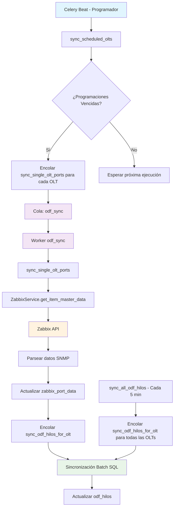

# 🔄 Sistema de Sincronización ODF - Documentación Completa

## 📋 Resumen Ejecutivo

El sistema de sincronización ODF es un conjunto de tareas automatizadas que mantiene sincronizadas las tablas `odf_hilos` y `zabbix_port_data` con datos en tiempo real desde Zabbix. El sistema funciona mediante **Celery** con programación automática cada 30 minutos.

---

## 🗂️ Archivos de Log del Sistema

### 📊 **Logs Activos (En Uso)**

#### **1. Log Principal del Sincronizador ODF**
```
/opt/facho_deluxe_v2/celery_odf_final.log
```
- **Componente**: Workers de cola `odf_sync`
- **Contenido**: Todas las tareas de sincronización ODF
- **Tareas registradas**:
  - `sync_single_olt_ports` - Sincronización individual de OLTs
  - `sync_odf_hilos_for_olt` - Sincronización batch SQL
  - `sync_all_odf_hilos` - Sincronización masiva
- **Tamaño**: ~5MB (actualización continua)

#### **2. Log del Programador de Tareas**
```
/opt/facho_deluxe_v2/celery_beat_new.log
```
- **Componente**: Celery Beat (Programador)
- **Contenido**: Envío de tareas programadas
- **Tareas programadas**:
  - `odf-scheduled-collection` - Cada minuto
  - `sync-odf-hilos-every-5min` - Cada 5 minutos
  - `dispatcher-check-and-enqueue` - Cada 30 segundos

#### **3. Log de Workers SNMP**
```
/opt/facho_deluxe_v2/celery_discovery_final.log
```
- **Componente**: Workers de cola `discovery_main`
- **Contenido**: Tareas SNMP generales y discovery
- **Tareas registradas**:
  - `discovery_main_task` - Descubrimiento SNMP
  - `dispatcher_check_and_enqueue` - Dispatcher inteligente
  - `cleanup_old_executions_task` - Limpieza de logs

### 🗑️ **Logs Obsoletos (Eliminados)**
```
❌ celery_beat.log           # Beat anterior (reemplazado por celery_beat_new.log)
❌ celery_discovery_new.log  # Workers discovery anteriores
❌ celery_odf_worker_new.log # Workers odf_sync anteriores  
❌ celery_worker.log        # Workers generales anteriores
```

---

## 🔄 Diagrama de Flujo del Sistema



---

## 🏗️ Arquitectura del Sistema

### 1️⃣ **Componentes Principales**

#### **A. Programador (Celery Beat)**
- **Archivo**: `celery_beat_new.log`
- **Función**: Ejecuta tareas según cronograma
- **Tareas programadas**:
  - `odf-scheduled-collection`: Cada minuto
  - `sync-odf-hilos-every-5min`: Cada 5 minutos

#### **B. Workers de Procesamiento**
- **Cola `odf_sync`**: Procesa tareas de sincronización ODF
- **Cola `discovery_main`**: Procesa tareas SNMP generales
- **Configuración**: `core/settings.py` → `CELERY_TASK_ROUTES`

#### **C. Servicios de Datos**
- **ZabbixService**: Conexión con API de Zabbix
- **Modelos Django**: `odf_hilos`, `zabbix_port_data`, `odf`

---

## 🔧 Tareas del Sistema

### 1️⃣ **sync_scheduled_olts** (Programación Principal)
```python
# Ubicación: odf_management/tasks.py:135
# Ejecución: Cada minuto via Celery Beat
# Función: Encuentra programaciones vencidas y encola tareas individuales
```

**Log de Ejemplo**:
```
[2025-09-29 10:11:39,865] Task odf_management.tasks.sync_scheduled_olts succeeded: 
{'schedules_processed': 2, 'olts_queued': 21, 'errors': 0}
```

### 2️⃣ **sync_single_olt_ports** (Sincronización Individual)
```python
# Ubicación: odf_management/tasks.py:19
# Ejecución: Por cada OLT programada
# Función: Obtiene datos de Zabbix y actualiza zabbix_port_data
```

**Log de Ejemplo**:
```
[2025-09-29 10:11:23,488] Task odf_management.tasks.sync_single_olt_ports[eed260c9-9850-4b5c-a491-efb667a2eefc] succeeded: 
{'success': True, 'olt': 'INC-5', 'stats': {'ports_created': 0, 'ports_updated': 0, 'ports_reactivated': 128, 'ports_disabled': 0, 'hilos_enabled': 0, 'hilos_disabled': 0, 'errors': 0}}
```

### 3️⃣ **sync_all_odf_hilos** (Sincronización Masiva)
```python
# Ubicación: odf_management/tasks.py:225
# Ejecución: Cada 5 minutos
# Función: Encola sync_odf_hilos_for_olt para todas las OLTs
```

### 4️⃣ **sync_odf_hilos_for_olt** (Sincronización Batch SQL)
```python
# Ubicación: odf_management/tasks.py:243
# Ejecución: Por cada OLT
# Función: Sincroniza odf_hilos ↔ zabbix_port_data usando SQL batch
```

**Log de Ejemplo**:
```
[2025-09-29 11:26:39,869] Task odf_management.tasks.sync_odf_hilos_for_olt[d4416a76-98b4-40a1-9574-555d57d7b73d] succeeded: 
{'success': True, 'olt': 'SD-1', 'stats': {'hilos_habilitados': 2, 'hilos_deshabilitados': 0, 'errores': 0, 'operativo_noc_sincronizados': 0}}
```

---

## 🔄 Proceso de Sincronización Detallado

### **Fase 1: Recolección de Datos desde Zabbix**
1. **Celery Beat** ejecuta `sync_scheduled_olts` cada minuto
2. Se identifican programaciones vencidas (cada 30 minutos)
3. Se encolan tareas `sync_single_olt_ports` para cada OLT
4. **ZabbixService** conecta con API de Zabbix
5. Se obtienen datos del item master (SNMP walk)
6. Se parsean estados administrativos, nombres de interfaz, descripciones
7. Se actualiza `zabbix_port_data` con datos frescos

### **Fase 2: Sincronización Batch entre Tablas**
1. **sync_all_odf_hilos** se ejecuta cada 5 minutos
2. Se encolan tareas `sync_odf_hilos_for_olt` para todas las OLTs
3. **SQL Batch** ejecuta 3 operaciones:

#### **Operación 1: Vincular Hilos Presentes**
```sql
UPDATE odf_hilos h
SET en_zabbix = TRUE,
    estado = CASE WHEN z.disponible THEN 'enabled' ELSE 'disabled' END,
    zabbix_port_id = z.id,
    updated_at = %s
FROM zabbix_port_data z, odf o
WHERE o.id = h.odf_id
  AND o.olt_id = %s
  AND h.slot = z.slot
  AND h.port = z.port
  AND z.olt_id = o.olt_id;
```

#### **Operación 2: Marcar Hilos Ausentes**
```sql
UPDATE odf_hilos h
SET en_zabbix = FALSE,
    estado = 'disabled',
    zabbix_port_id = NULL,
    updated_at = %s
FROM odf o
WHERE o.id = h.odf_id
  AND o.olt_id = %s
  AND NOT EXISTS (
      SELECT 1 FROM zabbix_port_data z
      WHERE z.olt_id = o.olt_id
        AND z.slot = h.slot
        AND z.port = h.port
  );
```

#### **Operación 3: Sincronizar operativo_noc**
```sql
UPDATE zabbix_port_data z
SET operativo_noc = h.operativo_noc
FROM odf_hilos h, odf o
WHERE o.id = h.odf_id
  AND z.olt_id = o.olt_id
  AND z.slot = h.slot
  AND z.port = h.port
  AND h.zabbix_port_id = z.id
  AND z.operativo_noc != h.operativo_noc;
```

---

## 📊 Estados y Campos Sincronizados

### **Tabla `zabbix_port_data` (Cache de Zabbix)**
- `estado_administrativo`: 1=UP, 2=DOWN
- `disponible`: TRUE/FALSE (si existe en Zabbix)
- `operativo_noc`: TRUE/FALSE (manual, sincronizado desde hilo)
- `last_sync`: Timestamp de última sincronización
- `descripcion_zabbix`: Descripción raw desde Zabbix

### **Tabla `odf_hilos` (Registro Manual)**
- `en_zabbix`: TRUE/FALSE (si existe en Zabbix)
- `estado`: 'enabled'/'disabled' (basado en disponible)
- `operativo_noc`: TRUE/FALSE (manual, fuente de verdad)
- `zabbix_port_id`: FK a zabbix_port_data
- `hilo_numero`: Número manual del hilo

---

## 🔍 Monitoreo y Debugging

### **Comandos de Verificación**

#### **1. Verificar Estado del Sistema**
```bash
# Ver workers activos
ps aux | grep celery | grep -v grep

# Ver logs en tiempo real
tail -f celery_odf_final.log

# Verificar colas Redis
redis-cli llen odf_sync
redis-cli llen discovery_main
```

#### **2. Verificar Sincronización**
```bash
# Buscar tareas recientes de sincronización ODF
grep "sync_single_olt_ports.*succeeded" celery_odf_final.log | tail -10

# Buscar sincronización batch
grep "sync_odf_hilos_for_olt.*succeeded" celery_odf_final.log | tail -10

# Verificar programaciones automáticas
grep "odf-scheduled-collection" celery_beat_new.log | tail -5

# Verificar sincronización masiva cada 5 min
grep "sync-odf-hilos-every-5min" celery_beat_new.log | tail -5
```

#### **3. Verificar Base de Datos**
```python
# En Django shell
from odf_management.models import ZabbixPortData, ODFHilos
from django.utils import timezone
from datetime import timedelta

# Puertos sincronizados recientemente
hace_10_min = timezone.now() - timedelta(minutes=10)
recientes = ZabbixPortData.objects.filter(last_sync__gte=hace_10_min).count()
print(f"Puertos sincronizados últimos 10 min: {recientes}")

# Estados administrativos
con_estado = ZabbixPortData.objects.filter(estado_administrativo__in=[1,2]).count()
print(f"Puertos con estado administrativo: {con_estado}")

# Hilos vinculados
vinculados = ODFHilos.objects.filter(zabbix_port__isnull=False).count()
print(f"Hilos vinculados a Zabbix: {vinculados}")
```

---

## ⚠️ Problemas Comunes y Soluciones

### **1. "En Zabbix (sin estado)"**
**Causa**: El hilo está vinculado pero `estado_administrativo` está vacío o NULL
**Solución**: 
```bash
# Verificar última sincronización de la OLT
python3 manage.py shell -c "
from odf_management.models import ODFHilos
hilo = ODFHilos.objects.get(id=12)
print(f'Último sync: {hilo.zabbix_port.last_sync}')
print(f'Estado admin: {hilo.zabbix_port.estado_administrativo}')
"
```

### **2. Tareas No Se Ejecutan**
**Causa**: Workers no están ejecutándose o routing incorrecto
**Solución**:
```bash
# Reiniciar workers
pkill -f "celery.*worker"
nohup venv/bin/celery -A core worker -l info -Q odf_sync -c 5 > celery_odf_final.log 2>&1 &
```

### **3. Estados Administrativos Vacíos**
**Causa**: Zabbix no devuelve datos del OID .1.3.6.1.2.1.2.2.1.7
**Solución**: Verificar configuración del item master en Zabbix

---

## 📈 Métricas de Rendimiento

### **Tiempos Promedio de Ejecución**
- `sync_single_olt_ports`: ~4-5 segundos por OLT
- `sync_odf_hilos_for_olt`: ~0.02-0.08 segundos por OLT
- `sync_all_odf_hilos`: ~1 segundo (solo encola tareas)

### **Volumen de Datos**
- **OLTs activas**: ~20-30
- **Puertos por OLT**: 64-240 puertos
- **Total puertos**: ~3,760 puertos
- **Frecuencia**: Cada 30 minutos (recolección), cada 5 minutos (sincronización)

---

## 🎯 Configuración de Programaciones

### **Admin Django**: `/admin/odf_management/zabbixcollectionschedule/`
- **Nombre**: FIBERPRO
- **Intervalo**: 30 minutos
- **OLTs**: 20 OLTs programadas
- **Próxima ejecución**: Calculada automáticamente

### **Configuración Celery Beat**: `core/settings.py`
```python
CELERY_BEAT_SCHEDULE = {
    'odf-scheduled-collection': {
        'task': 'odf_management.tasks.sync_scheduled_olts',
        'schedule': crontab(minute='*'),  # Cada minuto
    },
    'sync-odf-hilos-every-5min': {
        'task': 'odf_management.tasks.sync_all_odf_hilos',
        'schedule': crontab(minute='*/5'),  # Cada 5 minutos
    },
}
```

---

## 🔧 Mantenimiento

### **Limpieza de Logs**
```python
# Tarea automática cada 30 días
@shared_task
def cleanup_old_sync_logs():
    # Limpia errores antiguos de ZabbixCollectionOLT
```

### **Monitoreo de Salud**
- **Workers**: Verificar que estén ejecutándose
- **Colas**: Verificar que no se acumulen tareas
- **Logs**: Monitorear errores en tiempo real
- **Base de datos**: Verificar sincronización de estados

---

## 📞 Contacto y Soporte

### **Archivos de Log Activos**:
- `/opt/facho_deluxe_v2/celery_odf_final.log` - **LOG PRINCIPAL DEL SINCRONIZADOR**
- `/opt/facho_deluxe_v2/celery_beat_new.log` - Programador de tareas
- `/opt/facho_deluxe_v2/celery_discovery_final.log` - Workers SNMP

### **Comandos de Diagnóstico Rápido**:
```bash
# Estado general del sincronizador
tail -50 celery_odf_final.log | grep -E "(succeeded|ERROR)"

# Últimas sincronizaciones de OLTs
grep "sync_single_olt_ports.*succeeded" celery_odf_final.log | tail -5

# Verificar programaciones automáticas
grep "odf-scheduled-collection" celery_beat_new.log | tail -3

# Verificar workers activos
ps aux | grep celery | grep worker
```

### **Para el Problema "En Zabbix (sin estado)"**:
```bash
# Verificar última sincronización de una OLT específica
grep "sync_single_olt_ports.*succeeded" celery_odf_final.log | grep "VIR-16" | tail -1

# Verificar si hay errores en la sincronización
grep "ERROR\|Exception" celery_odf_final.log | tail -5
```

---

## 🧹 Limpieza de Logs Realizada

### **Logs Eliminados (Obsoletos)**:
- ❌ `celery_beat.log` (5.8KB) - Beat anterior
- ❌ `celery_discovery_new.log` (94KB) - Workers discovery anteriores  
- ❌ `celery_odf_worker_new.log` (1.5KB) - Workers odf_sync anteriores
- ❌ `celery_worker.log` (3KB) - Workers generales anteriores

### **Logs Activos Actuales**:
- ✅ `celery_odf_final.log` (5.0MB) - **LOG PRINCIPAL DEL SINCRONIZADOR**
- ✅ `celery_beat_new.log` (64KB) - Programador de tareas
- ✅ `celery_discovery_final.log` (232KB) - Workers SNMP

### **Beneficios de la Limpieza**:
- 🎯 **Claridad**: Solo 3 logs activos en lugar de 7
- 📊 **Organización**: Cada log tiene un propósito específico
- 🔍 **Debugging**: Más fácil encontrar información relevante
- 💾 **Espacio**: Liberados ~100KB de logs obsoletos

---

*Documento generado automáticamente - Sistema ODF Management v2.0*  
*Última actualización: 29 de Septiembre 2025 - Logs limpiados y organizados*
